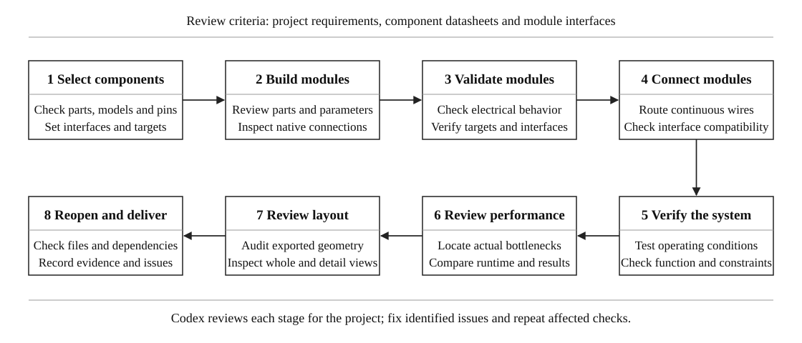

# Circuit Schematic Wiring & Simulation

**English** · [简体中文](README.zh-CN.md) · [Download skill ZIP](https://github.com/WHITEWARM/circuit-schematic-wiring-simulation/releases/latest/download/circuit-schematic-wiring-simulation.zip) · [Releases](https://github.com/WHITEWARM/circuit-schematic-wiring-simulation/releases) · [MIT License](LICENSE)

A Codex skill for selecting components, building clearly wired and reusable circuit designs, and troubleshooting modules according to project requirements.

Work from component selection through module implementation, local validation, visible interconnections, and system verification. Review the actual circuit at each stage, then improve schematic readability and simulation performance.

**Included:** a reusable workflow, Multisim guidance, an external-pin connectivity comparison tool, and an orthogonal layout audit tool. **Running Multisim requires your own installation and a working execution interface**, such as a compatible MCP server. This repository does not bundle a simulator or MCP server.

## Quick install

Send this to Codex:

```text
Use $skill-installer to install the skill at
skills/circuit-schematic-wiring-simulation
from https://github.com/WHITEWARM/circuit-schematic-wiring-simulation.
```

Then invoke `$circuit-schematic-wiring-simulation` in a new message. If the skill is not discovered, restart Codex and try again.

For a versioned download, use the [latest release](https://github.com/WHITEWARM/circuit-schematic-wiring-simulation/releases/latest). Extract `circuit-schematic-wiring-simulation.zip` and copy the complete skill folder into your project's `.agents/skills/` directory:

```text
your-project/
└─ .agents/
   └─ skills/
      └─ circuit-schematic-wiring-simulation/
         ├─ SKILL.md
         ├─ LICENSE
         ├─ agents/
         ├─ references/
         └─ scripts/
```

If you download the full repository instead, copy its `skills/circuit-schematic-wiring-simulation` folder. Keep the folder structure intact.

See the [official Codex skill documentation](https://learn.chatgpt.com/docs/build-skills) for discovery and installation locations. This project is community maintained; compatibility with other skill-capable clients has not been fully tested.

## What it helps you do

- **Select and implement components** to meet functional, performance, budget, and physical-build requirements.
- **Build readable, reusable circuits** with modular organization and visible native wiring.
- **Troubleshoot modules and their interfaces**, including connection, parameter, model, and functional problems, then verify the fix.
- **Review modules and complete systems** against the current project, improving readability, simulation efficiency, and portability while preserving required behavior.

Component choices and review criteria come from the current project. The workflow does not prescribe a particular chip, microcontroller policy, or model abstraction.

## Workflow



[Open the SVG figure](assets/workflow-en.svg) · [中文流程图](assets/workflow.svg)

Codex reviews **every module and work stage against the actual project requirements, component datasheets, and interfaces**. Review the implemented circuit and electrical connections, not just the plan or whether a tool returned success.

Record each applicable check as **pass, fail, unverified, or not applicable**, with evidence and a reason where needed. A fix invalidates affected earlier results; rerun the relevant module and downstream checks before declaring success.

After system integration and functional review, combine automated geometry checks with inspection of the native schematic at both full-sheet and detailed scales. Recheck connectivity and affected behavior after layout changes.

See [stage reviews and evidence records](skills/circuit-schematic-wiring-simulation/references/workflow-review.md). The installed skill instructions and detailed references are currently written in Chinese; this README and the workflow figure are available in both languages.

## Visible wiring is part of correctness

**Visible native electrical wires must determine all connections between components**, including signals, power, and ground.

Labels may annotate an existing wire. They must not create connections across gaps. Models must expose their external connections through visible pins, without hidden global aliases or fixed cross-component event bindings. Editing a critical wire must change the actual solver connection.

Use readable spacing, clear junctions, and unambiguous crossings. Remove duplicate or overlapping wires, keep symbols and labels clear of routes, and enlarge or rearrange the sheet when necessary.

## Example requests

### Design and implement a circuit

```text
Use $circuit-schematic-wiring-simulation.

Design and implement a circuit for the requirements in this project.
Select components that meet the specified electrical and purchasing constraints.
Validate each module before connecting the complete system.
Use visible native wires for every external signal, power, and ground connection.
Derive review criteria from this project and report the evidence and any unverified items.
```

### Diagnose an existing module

```text
Use $circuit-schematic-wiring-simulation to review this native circuit project.

The module output does not match the expected behavior.
Inspect its actual components, parameters, electrical connections, and interfaces.
Identify the cause, fix the affected part, and verify it locally and in the system.
```

### Improve layout and simulation performance

```text
Use $circuit-schematic-wiring-simulation.

Improve this schematic's readability and investigate its simulation bottleneck.
Preserve the required electrical behavior and visible wiring.
Check actual connectivity after layout changes and compare simulation results
and elapsed time under equivalent test conditions.
```

## Requirements and scope

| Task | Requirement |
|---|---|
| Load the workflow | A Codex environment with local skill support |
| Run the two checkers | Python 3; standard library only, tested with Python 3.12 |
| Open, edit, and simulate native Multisim circuits | Your installed, licensed Multisim and a compatible execution interface |
| Check specifications and availability | Manufacturer documentation and current purchasing information |
| Audit native geometry | An export of actual schematic objects from your EDA tool or a verified adapter |

The package does **not** include Multisim, an MCP server, vendor libraries, an `.ms14` codec, native geometry exporters, or an automatic routing/simulation engine. The Multisim notes come from version 14.3 project work; prove the minimum workflow on your own version before scaling up.

A functional model only verifies the behavior it represents. Physical accuracy still requires appropriate component selection, error analysis, calibration, and measurement.

### Using Multisim MCP

The development environment used the unofficial [multisim-mcp project](https://github.com/yxy050208/multisim-mcp). Install and configure it separately if that is your chosen execution interface.

The skill defines the design and review process; the MCP server exposes supported operations; the local Multisim installation performs native application work. A successful MCP connection is not evidence that a new schematic, display, or wiring path has been verified.

See [Multisim setup and implementation notes](skills/circuit-schematic-wiring-simulation/references/multisim.md) and the [official Codex MCP documentation](https://learn.chatgpt.com/docs/extend/mcp?surface=cli). Local runtime diagnostics for version 1.2.0 passed on the development machine on 2026-09-10; this is not a fresh-machine or end-to-end compatibility guarantee.

## Included checkers

Run these commands from the repository root.

### Compare external-pin connectivity

Compare independently obtained pin groups, such as visible native-wire connectivity and the solver's exported connectivity:

```text
python skills/circuit-schematic-wiring-simulation/scripts/compare_connectivity.py visible.json native.json --report comparison.json
```

Each input uses this structure:

```json
{
  "nets": [
    {"id": "input", "pins": ["U1.2", "R1.1"]},
    {"id": "output", "pins": ["R1.2", "U2.3"]},
    {"id": "unused", "pins": ["U2.4"]}
  ]
}
```

The tool ignores net names and ordering while detecting changed pin groupings, missing/extra pins, splits, and merges. Exit codes: `0` equivalent, `1` different, `2` invalid input or file error.

It does not parse `.ms14`, extract wires, inspect hidden model bindings, or run simulations. Independently obtain the input data; two matching exports alone do not prove the complete circuit is correct.

### Audit orthogonal schematic geometry

```text
python skills/circuit-schematic-wiring-simulation/scripts/audit_layout.py geometry.json --report layout-report.json
```

The input describes the actual canvas, horizontal/vertical wire segments, component body boxes, and label boxes. The checker reports duplicate/overlapping wires, insufficient parallel-wire spacing, obstructions, overlapping bodies/labels, objects outside the canvas, zero-length wires, and font-size issues. Crossings between different nets require visual review; geometry alone cannot prove a short circuit.

Exit codes: `0` no findings in the exported geometry, `1` findings or crossings to review, `2` invalid input or file error. Set spacing and font thresholds for the project's intended viewing or printing size.

The report explicitly leaves native connectivity, rendered readability, and export completeness unchecked. Follow it with native schematic inspection. See [data formats and audit procedure](skills/circuit-schematic-wiring-simulation/references/visible-wiring.md) for details.

## Validation

```text
python -m unittest discover -s tests -v
```

The 38 tests cover the two checkers and package structure, including invalid inputs and protection against overwriting input files. They do not constitute end-to-end Multisim validation or proof that a newly generated circuit works.

## Project files

```text
README.md
README.zh-CN.md
LICENSE
assets/
  workflow-en.svg
  workflow.svg
skills/circuit-schematic-wiring-simulation/
  SKILL.md
  LICENSE
  agents/openai.yaml
  references/
    workflow-review.md
    visible-wiring.md
    verification-optimization.md
    multisim.md
  scripts/
    compare_connectivity.py
    audit_layout.py
tests/
  test_connectivity.py
  test_layout.py
```

## Feedback

[Open an issue](https://github.com/WHITEWARM/circuit-schematic-wiring-simulation/issues) with the relevant software/version, the expected and observed behavior, and a minimal reproducible example. Distinguish a workflow instruction problem from a checker or simulator-interface problem so the fix can target the right layer.

## License

Original instructions, references, figures, and scripts are distributed under the [MIT License](LICENSE). External software, device models, and manufacturer resources are not bundled and remain subject to their own licenses.
