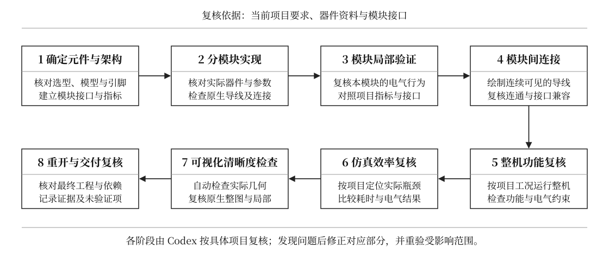

# 电路原理图设计、可见接线与仿真验证

**Circuit Schematic Wiring & Simulation** · Agent Skill · 中文工作流 · MIT

面向 Codex 的电路设计 skill：按任务要求选用或实现元件，先验证模块，再用清晰可见的导线连接整机，检查真实连通性、优化仿真，并交付可复现的工程与原理图。

An agent skill for circuit schematic design, explicit visible wiring, modular simulation, stage-by-stage Codex review, and simulation performance analysis. Includes Multisim implementation notes, connectivity comparison, and geometric layout auditing tools.

**加载 skill 不需要 MCP；自动操作 Multisim 需要可用的执行接口。** 本仓库提供工作流和检查脚本。使用 Multisim MCP 时，仍需单独安装、配置它及本机 Multisim，见下方“Multisim MCP 配套”。

## 工作流程



[查看 SVG 矢量原图](assets/workflow.svg)。采用统一方框、水平/垂直连线和黑白排版，按箭头顺序阅读。

**每个模块、每项修改、每个阶段完成后都有 Codex 复核。复核项根据具体项目生成，检查实际电路及电气连接中存在的问题。** 器件手册、模块接口和项目指标决定检查方式、测试条件及通过标准，不固定套用温度计或数码管案例。失败回到对应环节修复，再重验受影响模块及下游功能。记录“通过 / 失败 / 未验证 / 不适用”及证据；缺少该项所需证据时不写通过。检查点由 Codex 执行，不要求用户逐项确认。

自动几何检查与看图复核共同检查重复线、重合线、遮挡、越界、线距及交叉含义；布局修改后重新核对实际连接和功能。具体要求见 [阶段复核与证据记录](skills/circuit-schematic-wiring-simulation/references/workflow-review.md)。

## 适合做什么

- 根据器件、精度、量程、预算和实物制作要求提出方案并实现电路。
- 检查缺失模型、引脚映射、元件属性和保存重开后的原生工程。
- 将电源、输入、转换、控制和显示等模块逐个验证，再连接整机。
- 排查数码管不亮、显示为零、不再更新、漏计等问题。
- 检查导线是否真正连接引脚，以及整图接线是否清楚、连续、可追踪。
- 区分电路启动等待与求解耗时，在保持验证目标的前提下优化速度。

元件条件来自当前任务，不固定使用某种芯片，不默认禁用或允许单片机，也不默认使用功能等效模型。

## 核心接线要求

**所有元件外部连接都由图上可见的原生电气导线决定。**

信号、电源和地均需绘出连续线路。网络标签只用于说明，不能替代导线；模型不能通过隐藏的全局节点或固定事件绑定绕过外部端口。修改或断开图上的关键线路，实际求解连接必须随之改变。

布局应保留走线间距，避免不同网络重合、重复导线、遮挡元件和文字。空间不足先调整位置或扩大画布。

## 安装到 Codex

### 从 GitHub 安装

将下面这段话发给 Codex：

```text
使用 $skill-installer，从 GitHub 仓库
https://github.com/WHITEWARM/circuit-schematic-wiring-simulation
安装 skills/circuit-schematic-wiring-simulation。
```

安装后，在下一条消息中调用 `$circuit-schematic-wiring-simulation`。如果技能未显示，重新打开 Codex 后再检查。

### 手动下载到项目

下载并解压仓库，将 `skills/circuit-schematic-wiring-simulation` 这个完整文件夹复制到目标项目的 `.agents/skills/` 下，最终路径为：

```text
你的项目/
└─ .agents/
   └─ skills/
      └─ circuit-schematic-wiring-simulation/
         ├─ SKILL.md
         ├─ LICENSE
         ├─ agents/
         ├─ references/
         └─ scripts/
```

在 Codex 中打开该项目后调用技能。保留内部目录结构，不要只复制 `SKILL.md`，也不要多嵌套一层同名文件夹。

安装位置与发现机制参考 [OpenAI 官方技能文档](https://learn.chatgpt.com/zh-Hans/docs/build-skills)。其他支持 `SKILL.md` 的客户端需要按照各自的安装方式配置，本仓库尚未验证它们的完整兼容性。

## 使用示例

### 设计并实现电路

```text
使用 $circuit-schematic-wiring-simulation。
设计 0～100°C 数字温度计，分辨率 0.1°C，目标误差不超过 ±0.5°C。
允许 LM35 和 ADC，不使用单片机；器件应方便在国内购买和搭建。
先分析元件模型，再分模块实现、仿真验证，最后连接整机。
使用 Multisim，所有外部接线必须清晰可见，不能用同名网络标签代替。
```

### 排查和提速

```text
使用 $circuit-schematic-wiring-simulation，检查这个原生工程。
数码管始终显示 0，修改输入也没有变化。先沿信号链定位原因，
修复后验证不同输入和连续刷新，再测量并优化取得首次有效结果的时间。
```

### 整理原理图

```text
使用 $circuit-schematic-wiring-simulation，整理已有电路的布局。
保留原有正确功能，把跨模块信号、电源和地画成连续可见的导线，
去掉重复走线，避免导线和文字重叠，并核对整理前后的实际连接。
```

## 环境与能力范围

| 内容 | 需要的环境 |
|---|---|
| 加载设计工作流与参考资料 | 支持本地技能的 Codex 环境 |
| 运行连接比较与几何检查脚本 | Python 3，仅使用标准库；已在 Python 3.12 验证 |
| 进行 Multisim 原生仿真和工程操作 | 使用者已安装的 Multisim，以及当前环境可用的操作接口或 UI 工具 |
| 核对器件规格与采购情况 | 厂商资料和当前采购渠道；由任务环境提供访问能力 |

本包包含工作流、参考资料和两项检查工具。它没有附带 Multisim、MCP 服务端、厂商器件库、原生几何导出适配器、`.ms14` 编解码器或自动布线/仿真引擎；安装 skill 不会自动增加这些底层能力。Multisim 参考来自 14.3 工程实践，其他版本需先用最小电路验证。

功能等效模型只证明其覆盖范围内的行为；完整实物精度仍需要器件误差分析、选型、校准与实测。

## Multisim MCP 配套

| 部分 | 职责 |
|---|---|
| 本 skill | 元件选择、模块流程、可见接线规则、Codex 复核与验收 |
| Multisim MCP 或其他可用接口 | 向 Codex 提供工程操作、仿真及导出工具；具体能力以所用版本实测为准 |
| 本机 Multisim | 打开原生工程、执行仿真、显示原理图及数码管；由使用者自行安装并取得许可 |

这次开发环境使用了非官方 [multisim-mcp](https://github.com/yxy050208/multisim-mcp)。2026-09-10 的本机只读检查确认版本为 `1.2.0`，自动化运行环境兼容、原理图模板已就绪。这只证明该机器的环境状态，不证明其他机器安装后即可直接复现全部电路功能。

安装和配置入口、最小验证步骤见 [Multisim 配套接口](skills/circuit-schematic-wiring-simulation/references/multisim.md)。本仓库不打包个人运行目录或从 NI 安装提取的模板。即使 MCP 已连接，也需验证原生显示、可见导线及改线后的求解行为。

Codex 的 MCP 配置方式参考 [OpenAI 官方 MCP 文档](https://learn.chatgpt.com/docs/extend/mcp?surface=cli)。

## 连接比较工具

工具比较两份独立取得的外部引脚分组，忽略网络名称变化，识别漏接、错接、网络合并和网络分裂。例如一份来自可见导线，另一份来自目标软件的实际网表。

输入格式：

```json
{
  "nets": [
    {"id": "input", "pins": ["U1.2", "R1.1"]},
    {"id": "output", "pins": ["R1.2", "U2.3"]},
    {"id": "unused", "pins": ["U2.4"]}
  ]
}
```

在仓库根目录运行：

```text
python skills/circuit-schematic-wiring-simulation/scripts/compare_connectivity.py visible.json native.json --report comparison.json
```

退出码 `0`：分组相同；`1`：存在连接差异；`2`：输入或文件错误。

该工具不直接读取 `.ms14`、不自动识别图像或导线几何，也不运行仿真。需要先独立取得输入数据；两份文件相同不能代替实际接线验收。完整检查方法见 [可见接线参考](skills/circuit-schematic-wiring-simulation/references/visible-wiring.md)。

## 自动几何检查工具

从最终原生工程导出导线段、元件主体框、文字框及画布范围后运行：

```text
python skills/circuit-schematic-wiring-simulation/scripts/audit_layout.py geometry.json --report layout-report.json
```

检查重复/重合线、过近的平行线、线穿元件或文字、元件/文字重叠、画布越界、零长度线和字号；不同网络交叉会列为看图复核项，不能仅凭几何认定短路。输入格式见 [几何数据与审查步骤](skills/circuit-schematic-wiring-simulation/references/visible-wiring.md)。

退出码 `0`：已导出的几何未发现问题；`1`：有问题或待复核交叉；`2`：输入或文件错误。脚本只检查正交线段，**不读取 `.ms14`，不验证导出完整性，也不代替实际连接检查或 Codex 看图**。报告明确保留这些未检查范围。

## 验证

在仓库根目录运行：

```text
python -m unittest discover -s tests -v
```

测试覆盖连接比较、几何审查、非法输入及报告文件保护。测试只验证两个检查工具及包结构，不等同于已经完成某个新电路的仿真、原生显示或自动布线验收。

## 仓库内容

```text
README.md
LICENSE
assets/workflow.svg
skills/circuit-schematic-wiring-simulation/
  SKILL.md
  LICENSE
  agents/openai.yaml
  references/visible-wiring.md
  references/verification-optimization.md
  references/multisim.md
  references/workflow-review.md
  scripts/compare_connectivity.py
  scripts/audit_layout.py
tests/test_connectivity.py
tests/test_layout.py
```

## 许可

本仓库原创工作流、参考说明与脚本采用 [MIT License](LICENSE)。软件和厂商资料等外部资源不随本包分发，其使用遵循各自许可。
